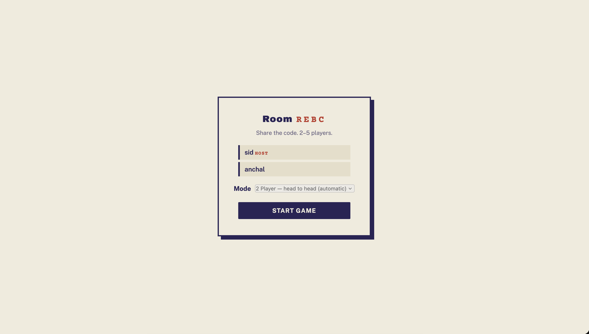
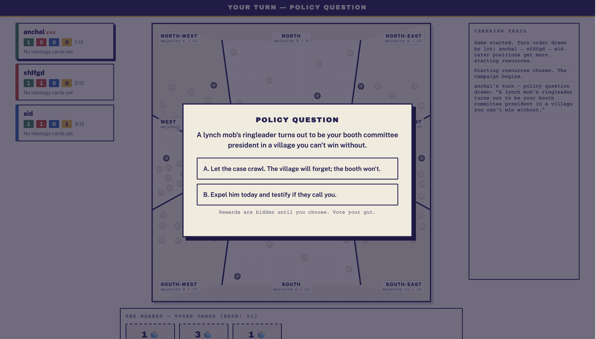
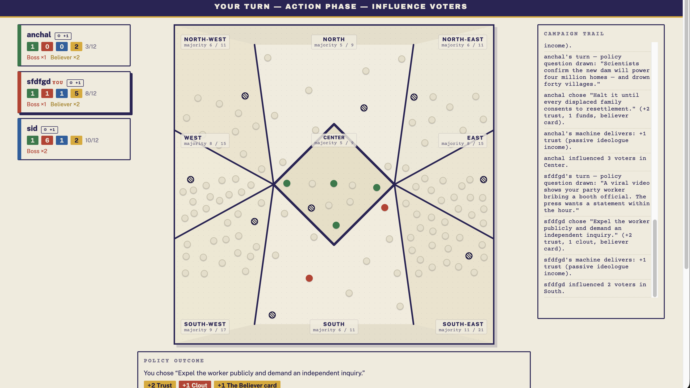
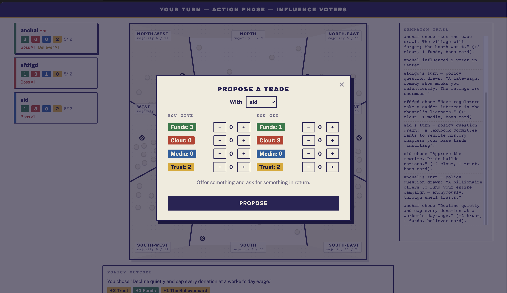

# The System

A multiplayer web game of political-strategy area control: 2–5 players compete for
control of 9 electoral zones through resource management, trading, gerrymandering,
conspiracies, and coalition-building — no installs, just a browser.

> **Origin note, for transparency:** This project started as a digital adaptation of
> **Shasn** (designed by Zain Memon, published by Memesys Culture Lab) — several early
> design decisions were made by directly consulting Shasn's rulebooks. Before making this
> repo public, we renamed every distinctive game element (the game's name, the four
> ideologies, their resources, the elite-power roster, and the endgame mechanic) to
> original names, so nothing here reuses Shasn's specific names or copied rulebook
> content. What's left is a game in the same *genre* (area control + hidden-resource
> negotiation), built with original card text throughout, but it is **not** Shasn, and
> isn't affiliated with or endorsed by Memesys Culture Lab or Zain Memon.

**Why build this:** a physical board game needs 2–5 people, a table, and 2–6 hours in one
room — a real barrier to who gets to play it and how often. Putting the game in a browser
removes that: anyone with a laptop can play, replay, or study a session. That accessibility
angle is also why this exists as an open project rather than a closed one — it doubles as a
research and education vehicle for area-control game design, negotiation-driven mechanics,
and multiplayer web-game architecture, in a way a physical box can't easily support.

---

## What is The System?

Each player picks an **ideology** and fights to win the popular vote across 9 zones on
the board. You buy voter cards to grow your manifesto, place campaign pegs to build
majorities, and use each ideology's resource to trade, bribe, sabotage, and gerrymander
your way to power. It's part area-control, part social-deduction, all played at the
negotiating table — most of the game happens in the deals players cut with each other,
not in isolated turns.

### Ideologies

| Name | Color | Resource |
|---|---|---|
| The Mogul | Green | Funds |
| The Boss | Red | Clout |
| The Icon | Blue | Buzz |
| The Believer | Yellow | Trust |

### Core concepts

| Term | Meaning |
|---|---|
| **The Market** | Central board where face-up Voter Cards are displayed for purchase |
| **Manifesto** | A player's collection of ideology cards; higher count = level-up perks |
| **Constituency / Zone** | One of 9 electoral zones; captured by reaching the majority threshold |
| **Gerrymandering Phase** | Move a non-majority peg adjacent to a zone where you hold majority |
| **Headline Card** | Event card triggered when a peg is placed in a Volatile Area |
| **Conspiracy Card** | Hidden-hand card with a targeted effect on another player |
| **IOU** | "I Owe You" token — player-to-player and bank debt mechanic |
| **Elite Card** | Passive/active power that turns on automatically once your manifesto qualifies |

---

## Screenshots

| Room lobby | Policy question |
|---|---|
|  |  |

| Board mid-game | Proposing a trade |
|---|---|
|  |  |

---

## Status

**Full rule set is implemented and playable.** Trading, gerrymandering, majority breaking,
headlines/volatile areas, conspiracies, IOU + auctions, manifesto perks, elite powers, and
four selectable game modes (Coalitions, Home Turfs, Hidden Objectives, 2-Player) are all
built and covered by automated tests. Players can talk in **chat** — table talk for the
whole room plus a private line to each player, in the lobby and in-game (💬 bottom-right,
or the 💬 on any rival's dossier).

**What's left before this is a polished product:**
- **Edge of Chaos mode** — not yet built.
- **UX overhaul** — elaborate player mats, in-app rules explanations,
  visible timers, board change highlights — aimed at players who don't already know the
  game by heart.
- **Art** — all card content (150 policy cards, 36 headlines, 24 conspiracies, 13 elites,
  34 voter cards) is original text and in place; none of it has illustration/art yet.

Manual multi-tab playtesting is next, then a merge to `main`.

---

## Tech stack

- **Server:** Node.js + Express + Socket.IO. An authoritative, framework-free game engine
  (`server/game.js`) drives all rules; rooms/sockets (`server/index.js`) are a thin
  transport layer on top, so the engine is fully unit-testable without a network.
- **Client:** Vanilla JS, no build step (`public/`).
- **Persistence:** Debounced JSON snapshot to disk (`server/persistence.js`) so in-progress
  games survive a server restart; players reconnect automatically via a session token.

## Getting started

```bash
npm install
npm start          # serves the game on http://localhost:3000
```

Open `http://localhost:3000` in 2–5 browser tabs (or devices on the same network), create
a room, share the 4-letter code, and play.

### Running tests

```bash
npm test           # full suite: bot-simulated games, rule invariants, modes, persistence, socket e2e
```

## Deploying

See [`DEPLOY.md`](./DEPLOY.md) for Railway/Render/Fly/Docker instructions. The short
version: it's a single Node process, needs sticky WebSocket sessions (no scaling out
behind a buffering proxy), and a mounted volume if you want game state to survive
restarts.

---

## Repo guide

| File | Purpose |
|---|---|
| `server/game.js` | The authoritative rules engine — pure logic, no networking |
| `server/index.js` | Rooms, Socket.IO wiring, reconnect handling |
| `server/chat.js` | Room chat: table + private channels, validation, rate limit |
| `public/` | Browser client (HTML/CSS/vanilla JS) |
| `data/*.json` | Card decks, zones, modes data — original content |
| `test/` | Bot-simulation, rule-invariant, and end-to-end socket tests |

## Contributing

See [`CONTRIBUTING.md`](./CONTRIBUTING.md) for the branch/PR workflow. Short version:
branch off `main`, open a PR, get a review, squash-merge.

## License

Licensed under the [PolyForm Noncommercial License 1.0.0](./LICENSE). You're free to
use, modify, and share this for any noncommercial purpose — personal projects, research,
education. Commercial use requires permission. Open an issue or reach out if you want to
discuss that.

---

*Built by the project team.*
